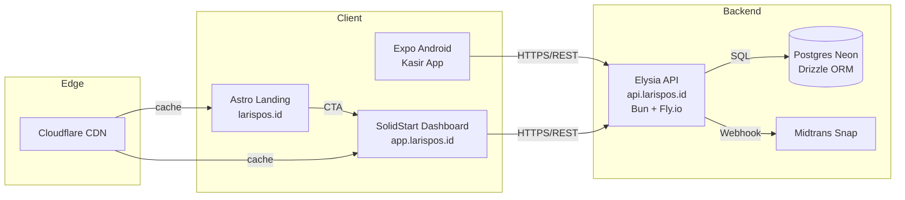
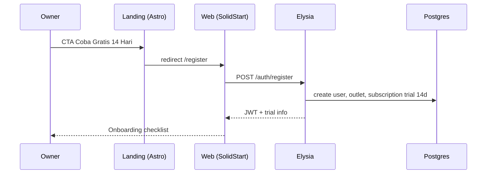
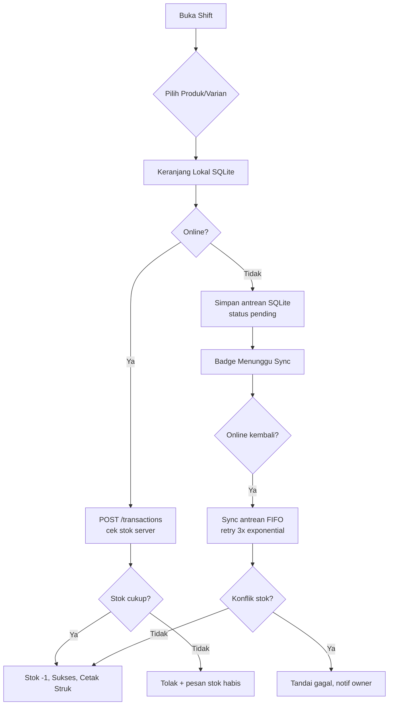
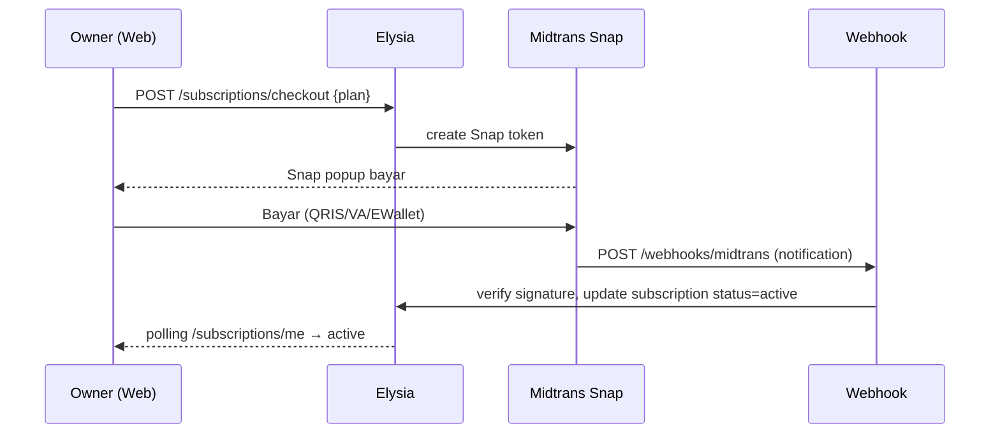

# ARCHITECTURE.md — LarisPOS (POS UMKM F&B)

> Turunan dari **PRD.md**. Menjawab semua Open Question PRD dengan keputusan teknis konkret. Tidak mengulang narasi bisnis — hanya arsitektur.

---

## 1. Keputusan Tech Stack Final

> **Kebijakan Versi:** Selalu gunakan `latest stable` untuk semua packages/dependencies. Jika versi latest belum stable (alpha/beta/canary), pakai latest stable. Jangan pin versi lama tanpa approval.

| Layer | Keputusan | Versi / Catatan | Alasan vs Alternatif |
|---|---|---|---|
| **Web Dashboard** | **SolidJS + SolidStart 1.x** (meta-framework) + **TailwindCSS** + **TanStack Query (solid-query)** | Solid latest stable, SolidStart dengan SSR + file-based routing | SolidJS sesuai preferensi — performa tercepat (no VDOM), bundle kecil cocok untuk target UMKM dengan device/laptop low-end. SolidStart dipilih atas vanilla Solid karena butuh SSR untuk initial load cepat & proteksi route server-side. Alternatif (Vite SPA) ditolak: SEO dashboard tidak kritis tapi SSR bantu FCP & auth guard. |
| **Mobile Kasir (Android only)** | **Expo SDK 52+ + Expo Router + NativeWind** | Expo latest stable, React Native latest stable, Expo Router file-based | Expo sesuai preferensi. Expo Router = routing deklaratif seperti Next. NativeWind = Tailwind di RN. Eject tidak perlu di MVP. |
| **Backend API** | **ElysiaJS on Bun 1.2+** | Elysia latest stable, Bun runtime latest stable | Sesuai preferensi. Elysia = fastest Bun framework, type-safe (Eden), built-in OpenAPI. Cocok untuk volume tinggi margin tipis. Alternatif Hono/Nest ditolak: Elysia paling idiomatik di Bun. |
| **Landing Page (SEO)** | **Astro 5 + TailwindCSS** (terpisah dari dashboard) | Astro latest stable, static + islands, `apps/landing` | **Keputusan best practice:** Pisah dari dashboard. Astro = 0 JS by default, image optimization, sitemap/OG/schema built-in, Lighthouse 95+ mudah. SolidStart bisa SSR tapi bundle dashboard (auth, query) ikut kebawa ke landing → lambat & SEO tidak optimal. Pisah = deploy edge murah, caching agresif, tidak ganggu deploy dashboard. Domain: `larispos.id` (landing), `app.larispos.id` (dashboard). |
| **Database** | **PostgreSQL 16 + Drizzle ORM** | Postgres latest stable, Drizzle latest stable, `drizzle-kit` latest stable | Sesuai preferensi. Relasional kuat untuk laporan agregasi, window function jam ramai. Drizzle = lightweight, SQL-like, type-safe, migrasi simpel — lebih ringan dari Prisma untuk infra lean. |
| **Validasi & Shared Types** | **TypeBox (Elysia) + Zod (frontend) atau Valibot** — unify via **`@larispos/shared`** | Single source: `packages/shared` export Zod/TypeBox schema | Elysia native TypeBox, tapi frontend Solid/Expo enak Zod. Solusi: define di `shared` pakai **TypeBox** lalu generate Zod via `typebox-to-zod` atau pakai **Valibot** universal. Keputusan: **Zod di shared** + `elysia-zod` adapter (atau `drizzle-zod`) — DX lebih konsisten. |
| **Auth** | **JWT (access 15m + refresh 7d, httpOnly cookie untuk web, SecureStore untuk mobile) + PIN hash (bcrypt) untuk kasir** | `jose` / `elysia-jwt` | Stateless, horizontal scale gampang. PIN 6-digit di-hash bcrypt, tidak reversible. |
| **Offline Local DB (Mobile)** | **expo-sqlite (SQLite) + drizzle-orm/expo-sqlite + MMKV untuk session** | SQLite untuk antrean transaksi, MMKV untuk token | SQLite sesuai keputusan brainstorm — bisa query rekap shift offline, antrean reliable. MMKV hanya untuk key-value cepat. |
| **Realtime/Sync** | **HTTP polling + manual sync trigger** (MVP), upgrade ke **SSE** post-MVP | Elysia SSE | Polling cukup untuk MVP (sync saat online event). SSE untuk notif stok menipis nanti. |
| **Bluetooth Print** | **react-native-ble-plx + escpos via `expo-print` / custom ESC/POS builder** | Printer 58mm ESC/POS | `ble-plx` paling stabil di Expo (config plugin). ESC/POS builder manual (buffer) lebih ringan dari lib berat. |
| **Payment Gateway (Langganan)** | **Midtrans Snap + Midtrans Subscription / Recurring (Core API)** | Snap untuk checkout, webhook `/webhooks/midtrans` | Sesuai keputusan Midtrans. Snap = UI hosted, tidak perlu PCI. Webhook verifikasi signature. |
| **Hosting** | **Backend: Fly.io (Bun) atau Railway** + **DB: Neon/Supabase Postgres** + **Web/Landing: Cloudflare Pages / Vercel Edge** + **CDN: Cloudflare** | Region SG (Singapore) | **Best practice murah & andal:** Fly.io = scale to zero, dekat SG latency <30ms ke ID, murah vs VPS manage sendiri. Neon = serverless Postgres, scale to zero, backup otomatis. Landing di Cloudflare Pages = gratis + edge cache. Alternatif VPS ID (IDCloudHost) ditolak MVP: ops overhead tinggi, backup manual. Cost est: ~$15-25/bulan untuk 500 outlet MVP. |
| **Monorepo Tooling** | **Bun workspaces + Turborepo** | `bun` latest stable, `turbo` latest stable | Bun = package manager + runtime (cepat, sesuai Elysia). Turborepo untuk task pipeline build/lint/test. |
| **API Client** | **Eden Treaty (Elysia) untuk web + fetch typed untuk mobile** | Eden = fully typed client dari Elysia | Type-safe end-to-end, tidak perlu codegen OpenAPI. |
| **Export Laporan** | **PDF: `pdf-lib` / `jspdf` (backend) + Excel: `exceljs`** | Generate di backend, stream ke frontend | Backend generate agar konsisten, tidak beban device kasir. |
| **Observability** | **Pino logger + Sentry + Uptime Kuma** | | Lean tapi cukup untuk 500 outlet. |

---

## 2. Struktur Monorepo

```
larispos/
├── apps/
│   ├── web/            # SolidStart dashboard (app.larispos.id)
│   ├── mobile/         # Expo RN kasir (Android)
│   ├── backend/        # Elysia API (api.larispos.id)
│   └── landing/        # Astro landing (larispos.id)
├── packages/
│   ├── shared/         # Zod schemas, TS types, constants, utils
│   ├── db/             # Drizzle schema, migrations, seed
│   └── ui/             # (opsional) shared design tokens
├── turbo.json
├── package.json        # Bun workspaces
└── .env.example
```

**Dependency rule:** `shared` & `db` tidak boleh import dari `apps/*`. `apps/*` import dari `packages/*`.

**Shared package contoh:**
```
packages/shared/src/
├── schemas/
│   ├── auth.ts
│   ├── outlet.ts
│   ├── product.ts
│   ├── transaction.ts
│   └── subscription.ts
├── types/
└── constants.ts
```

---

## 3. Arsitektur High-Level



---

## 4. Flow Charts

### 4.1 Onboarding & Trial


### 4.2 Transaksi Kasir Offline-First Sync


### 4.3 Langganan Midtrans


---

## 5. Database Schema (Postgres + Drizzle)

**Prinsip:** Semua tabel punya `id UUID PK`, `createdAt`, `updatedAt`. Multi-tenant via `ownerId` + `outletId`. Index untuk laporan: `(outletId, createdAt)`, `(productVariantId)`.

```mermaid
erDiagram
    users ||--o{ outlets : owns
    users ||--o{ staff : creates
    outlets ||--o{ staff : assigned
    outlets ||--o{ products : has
    products ||--o{ product_variants : has
    outlets ||--o{ payment_methods : has
    outlets ||--o{ transactions : has
    transactions ||--o{ transaction_items : has
    product_variants ||--o{ transaction_items : ref
    outlets ||--o{ shifts : has
    staff ||--o{ shifts : opens
    staff ||--o{ transactions : cashier
    users ||--o{ subscriptions : owns
    users ||--o{ subscription_history : has

    users {
        uuid id PK
        string email unique
        string phone
        string passwordHash
        string businessName
        enum role "owner"
        timestamp createdAt
    }
    outlets {
        uuid id PK
        uuid ownerId FK
        string name
        string address
        decimal taxPercent 0-11
        decimal servicePercent 0-11
        string receiptHeader
        string receiptFooter
        boolean isActive
    }
    staff {
        uuid id PK
        uuid ownerId FK
        uuid outletId FK
        string name
        string pinHash
        boolean isActive
    }
    products {
        uuid id PK
        uuid outletId FK
        string name
        string category
        decimal costPrice
    }
    product_variants {
        uuid id PK
        uuid productId FK
        string name
        decimal sellPrice
        integer stock
        integer lowStockThreshold default 5
    }
    payment_methods {
        uuid id PK
        uuid outletId FK
        string name
        enum type "cash|non_cash"
        string instruction
        boolean isActive
    }
    shifts {
        uuid id PK
        uuid outletId FK
        uuid staffId FK
        decimal openingCash
        decimal expectedCash
        decimal actualCash
        decimal difference
        enum status "open|closed"
        timestamp openedAt
        timestamp closedAt
    }
    transactions {
        uuid id PK
        uuid outletId FK
        uuid staffId FK
        uuid shiftId FK
        uuid paymentMethodId FK
        decimal subtotal
        decimal taxAmount
        decimal serviceAmount
        decimal total
        decimal cashReceived
        decimal change
        enum status "completed|voided"
        string voidReason
        string offlineId unique
        timestamp createdAt
    }
    transaction_items {
        uuid id PK
        uuid transactionId FK
        uuid productVariantId FK
        string productName snapshot
        string variantName snapshot
        decimal sellPrice snapshot
        decimal costPrice snapshot
        integer qty
        decimal lineTotal
    }
    subscriptions {
        uuid id PK
        uuid ownerId FK unique
        enum plan "starter|tumbuh|jaringan"
        enum status "trialing|active|past_due|dormant|frozen"
        integer maxOutlets
        timestamp trialEndsAt
        timestamp currentPeriodEnd
        string midtransSubscriptionId
    }
    subscription_history {
        uuid id PK
        uuid ownerId FK
        string plan
        string status
        decimal amount
        string midtransOrderId
        timestamp createdAt
    }
```

**Drizzle snippet (packages/db/src/schema.ts):**
```ts
export const productVariants = pgTable("product_variants", {
  id: uuid("id").primaryKey().defaultRandom(),
  productId: uuid("product_id").references(() => products.id).notNull(),
  name: varchar("name", { length: 100 }).notNull(),
  sellPrice: numeric("sell_price", { precision: 12, scale: 2 }).notNull(),
  stock: integer("stock").notNull().default(0),
  lowStockThreshold: integer("low_stock_threshold").notNull().default(5),
}, (t) => [index("idx_variant_product").on(t.productId)]);

export const transactions = pgTable("transactions", {
  id: uuid("id").primaryKey().defaultRandom(),
  offlineId: varchar("offline_id", { length: 36 }).unique(),
  outletId: uuid("outlet_id").references(() => outlets.id).notNull(),
  // ...
}, (t) => [
  index("idx_tx_outlet_created").on(t.outletId, t.createdAt),
  index("idx_tx_offline").on(t.offlineId),
]);
```

**Keputusan stok per varian:** `stock` di `product_variants` bukan `products`. Laporan stok menipis query `WHERE stock <= lowStockThreshold` per varian — akurat F&B.

---

## 6. Backend (Elysia on Bun)

**Struktur `apps/backend/src/`:**
```
src/
├── index.ts              # Elysia app, CORS, error handler
├── modules/
│   ├── auth/             # register, login owner, login kasir PIN
│   ├── outlets/
│   ├── products/
│   ├── transactions/     # POST /transactions (idempotent via offlineId)
│   ├── shifts/
│   ├── reports/          # agregasi laba, best seller, jam ramai
│   ├── subscriptions/    # checkout Midtrans, webhook
│   └── webhooks/midtrans.ts
├── plugins/
│   ├── auth.ts           # JWT guard, role guard
│   ├── subscriptionGuard.ts # cek trial/active sebelum transaksi
│   └── error.ts
└── db.ts
```

**API Contract (prefix `/api/v1`):**
- `POST /auth/register`, `POST /auth/login`, `POST /auth/cashier-login` { outletId, pin }
- `GET /outlets`, `POST /outlets` (guard maxOutlets by plan)
- `GET /products?outletId=`, `POST /products` (nested variants)
- `POST /transactions` — **idempotent**: client kirim `offlineId` (UUID v4 generate di mobile). Server `INSERT ... ON CONFLICT (offlineId) DO NOTHING` → cegah double sync.
- `POST /transactions/:id/void` { reason }
- `POST /shifts/open`, `POST /shifts/:id/close`, `GET /shifts?outletId=`
- `GET /reports/summary?outletId=&from=&to=` → { omzet, hpp, laba, count, avg }
- `GET /reports/best-sellers`, `GET /reports/busy-hours`, `GET /reports/payment-methods`
- `GET /reports/low-stock`
- `POST /subscriptions/checkout`, `GET /subscriptions/me`, `POST /webhooks/midtrans`

**Validasi stok (critical):** Di `POST /transactions` pakai **DB transaction + `SELECT ... FOR UPDATE`** pada `product_variants` yang terlibat → cek `stock >= qty` → decrement. Jika gagal → return 409 `INSUFFICIENT_STOCK`.

**Laporan query contoh:**
```sql
-- Laba per outlet per hari
SELECT date_trunc('day', t.createdAt) AS day,
       SUM(t.total) AS omzet,
       SUM(ti.costPrice * ti.qty) AS hpp,
       SUM(t.total) - SUM(ti.costPrice * ti.qty) AS laba
FROM transactions t JOIN transaction_items ti ON ti.transactionId = t.id
WHERE t.outletId = $1 AND t.status='completed' AND t.createdAt BETWEEN $2 AND $3
GROUP BY 1 ORDER BY 1;
-- Jam ramai
SELECT extract(hour from createdAt)::int AS hour, COUNT(*) AS cnt
FROM transactions WHERE outletId=$1 GROUP BY 1 ORDER BY 1;
```

---

## 7. Web Dashboard (SolidStart)

**Routing (file-based):**
```
apps/web/src/routes/
├── (marketing)/ # redirect ke landing
├── (auth)/login
├── (auth)/register
├── (app)/dashboard      # ringkasan hari ini
├── (app)/products
├── (app)/outlets
├── (app)/staff
├── (app)/reports
├── (app)/shifts
├── (app)/subscription
└── api/ # proxy ke backend jika perlu
```

**State & Data:** `TanStack Query` untuk fetch/caching, `solid-js/store` untuk keranjang preview. Auth guard via middleware SolidStart (cek cookie JWT, redirect ke /login).

**UI:** TailwindCSS, komponen base (Button, Card, Table) tanpa lib berat — atau `kobalte` untuk headless accessible jika perlu.

---

## 8. Mobile Kasir (Expo RN)

**Routing (Expo Router):**
```
apps/mobile/app/
├── (auth)/login.tsx      # PIN input
├── (app)/index.tsx       # pilih outlet (jika multi)
├── (app)/pos.tsx         # kasir cepat (grid produk + keranjang)
├── (app)/shift.tsx       # buka/tutup shift
├── (app)/history.tsx     # riwayat transaksi + void
└── _layout.tsx
```

**Local DB (expo-sqlite + Drizzle):**
```ts
// tabel lokal mirror: queued_transactions, products_cache, variants_cache
// queued_transactions: { offlineId, payload JSON, status 'pending'|'syncing'|'failed', retries, createdAt }
```
- Saat `POST /transactions` online gagal / offline → insert ke `queued_transactions`.
- Background sync: `NetInfo` listener → `online` → proses FIFO `pending` → `POST` dengan `offlineId` → hapus dari queue jika 200, tandai failed jika 409 (stok).
- Produk cache: sync `GET /products` saat online, simpan ke SQLite untuk offline browsing.

**Bluetooth Print:** `react-native-ble-plx` scan & connect thermal printer. ESC/POS builder:
```ts
const escpos = new EscPos();
escpos.textCenter("LarisPOS - Outlet A").line().table(items).total(total).cut();
await bleDevice.writeCharacteristicWithResponseForService(uuid, data);
```
Fallback jika tidak connect: `Share.share({ message: strukText })`.

---

## 9. Landing Page (Astro)

**Struktur `apps/landing/src/pages/`:**
```
index.astro        # Hero, Fitur, Harga, Testimoni, FAQ, CTA
tentang.astro
kebijakan.astro
components/ # PricingCard, FAQ, Hero
layouts/Layout.astro # SEO: title, meta, OG, schema.org
```

**SEO:**
- Astro `getStaticPaths` + `astro:assets` image optimization.
- `astro-sitemap`, `astro-robots-txt`, JSON-LD `Product` + `FAQPage` schema.
- Lighthouse target ≥95.

---

## 10. Auth & Role

- **Owner:** `email + password` (bcrypt 10), JWT access (15m) + refresh (7d, httpOnly cookie untuk web, `expo-secure-store` untuk mobile).
- **Kasir:** `PIN 6-digit` (bcrypt), `staff` row per outlet. Login `POST /auth/cashier-login` → JWT dengan claim `role: 'cashier', outletId, staffId`. PIN unik per outlet (unique index `(outletId, pinHash)` tidak feasible — cek di app logic: tidak boleh PIN sama di outlet yang sama).
- **Guard:** Elysia `derive` → `user` dari JWT. `roleGuard('owner')` untuk `/products` POST, `/outlets` POST, `/reports/*` (kasir hanya `GET /products` & `POST /transactions` di outlet-nya).
- **Multi-tenant:** Semua query `WHERE ownerId = ctx.user.id` atau `outletId IN (select id from outlets where ownerId=...)`.

---

## 11. Offline Sync Detail

- **Idempotency key:** `offlineId` UUID v4 generate di mobile sebelum simpan lokal. Server unique constraint cegah duplikat saat retry.
- **Queue:** FIFO, max retries 3, exponential backoff 2s/4s/8s.
- **Conflict:** Jika dua kasir kurangi stok varian sama → transaksi kedua dapat 409. Mobile tandai `failed`, tampilkan notif "Stok habis, sync gagal — void atau kurangi qty".
- **Stok lokal:** Optimistic decrement lokal untuk UX, tapi source of truth tetap server. Saat sync sukses, server return stok terbaru → update cache.

---

## 12. Midtrans Subscription

- **Flow:** `POST /subscriptions/checkout` → backend `fetch` Midtrans Snap `https://app.midtrans.com/snap/v1/transactions` dengan `order_id = sub_<ownerId>_<timestamp>`, `gross_amount` sesuai plan. Return `token` & `redirect_url` ke frontend → `window.snap.pay(token)`.
- **Webhook:** `POST /webhooks/midtrans` — verifikasi `SHA512(order_id+status_code+gross_amount+serverKey)`. Update `subscriptions` status: `capture/settlement` → `active`, `expire/cancel` → `past_due`.
- **Retry:** Midtrans notif retry otomatis. Backend juga cron harian cek `currentPeriodEnd < now() AND status=active` → set `past_due` → grace 7d → `dormant` → `frozen`.
- **Env:** `MIDTRANS_SERVER_KEY`, `MIDTRANS_CLIENT_KEY`, `MIDTRANS_IS_PRODUCTION=false` untuk sandbox.

---

## 13. Hosting, Infra & CI/CD

| Komponen | Hosting | Alasan Cost |
|---|---|---|
| Backend Elysia (Bun) | **Fly.io** (1-2 machines, auto-stop) | $5-10/bulan, SG region, scale to zero |
| Postgres | **Neon** (serverless, 0.5 CU) | Gratis tier awal, lalu $10/bulan, backup otomatis |
| Web Dashboard | **Cloudflare Pages** (SolidStart via adapter) | Gratis, edge cache |
| Landing Astro | **Cloudflare Pages** | Gratis, 0 JS, cache agresif |
| Mobile | **EAS Build** (Expo) | Build APK internal + store |
| CI | **GitHub Actions** | `bun install`, `turbo run build`, `drizzle migrate` |

**Deploy flow:** Push `main` → GH Actions → `fly deploy` (backend) + `wrangler pages publish` (web/landing) + `drizzle migrate` (Neon).

---

## 14. Keamanan & Observability

- **Password/PIN:** bcrypt 10, rate limit login 5/menit/IP (Elysia `rate-limiter`).
- **CORS:** hanya `app.larispos.id` & `larispos.id`.
- **Helmet, input sanitization (Zod).**
- **Logging:** Pino JSON, Sentry untuk error mobile & backend.
- **Backup:** Neon PITR 7 hari.

---

## 15. Jawaban Open Questions PRD (Mapping)

| # PRD | Jawaban |
|---|---|
| 1 Tech stack | SolidStart + Expo Router + Elysia (Bun) — locked di atas |
| 2 Landing | **Pisah Astro** (best practice SEO) — bukan nebeng dashboard |
| 3 Offline sync | SQLite + offlineId idempotency + FIFO + 409 conflict |
| 4 Bluetooth | `react-native-ble-plx` + ESC/POS manual, fallback Share |
| 5 DB Schema | Postgres + Drizzle, stok per varian, index (outletId, createdAt) |
| 6 Auth | JWT + PIN hash, role guard outlet-scoped |
| 7 Monorepo | Bun workspaces + Turborepo, apps/web|mobile|backend|landing + packages/shared|db |
| 8 Hosting | Fly.io + Neon + Cloudflare Pages (SG, ~$20/bulan untuk 500 outlet) |
| 9 Export | Backend `pdf-lib`/`exceljs`, stream ke frontend |
| 10 Midtrans | Snap + webhook signature, grace 7d |

---

## 16. Approval

- [ ] ARCHITECTURE disetujui → lanjut ke **AGENTS.md**
- [ ] Jika ada stack yang mau diganti (misal hosting VPS ID), sebutkan sebelum AGENTS.md.

---

*Dokumen ini menjadi acuan tunggal untuk AGENTS.md, subagents, skills, dan TASKS.md.*
